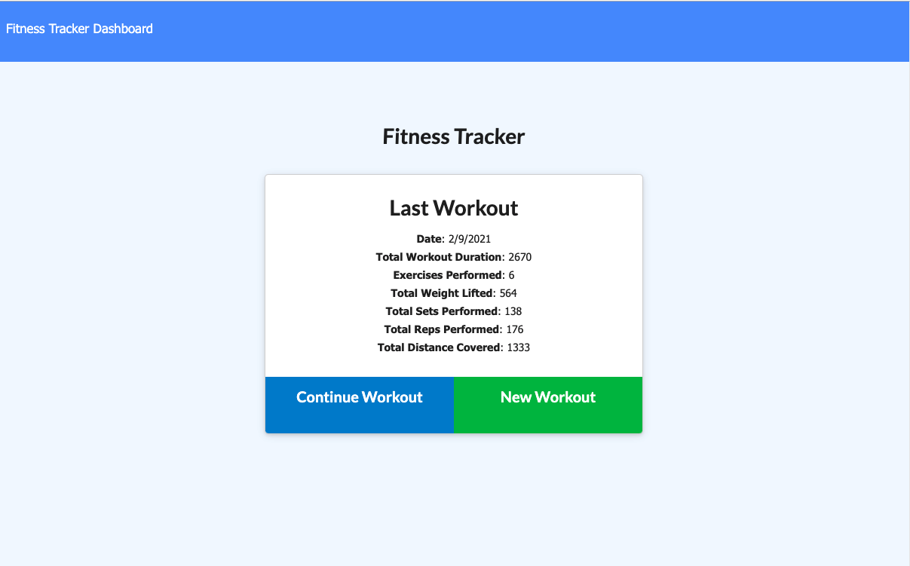

  # Workout Tracker

  ## Description
  A workout tracker created with a Mongo database with a Mongoose schema and routes with Express.
  

  ## Table of Contents
  * [Usage](#usage)
  * [Technologies](#technologies)
  * [Project URLs](#urls)
  * [Author](#author)


  ## Usage
   ```bash
   `npm install` to install all packages required to run the app. These include `express`, `mongoose` and `morgan`.
   ```
  ```bash 
  `npm run seed` to seed the database
  ```
  ```bash 
  `npm start` to run the app
  ```
  ```bash
  Navigate to `http://localhost:3000`
  ```

  


  ## Technologies
  * HTML
  * CSS
  * Express
  * MongoDB
  * Mongoose
  * Javascript
  * AJAX


  ## URLs
  * Heroku URL:
  https://morning-sea-49641.herokuapp.com/

  * Github Repo:
  https://github.com/evadllewop/WorkoutTracker
 

  ## Author

  Dave Powell

  

  * [Github Profile](https://github.com/evadllewop)


